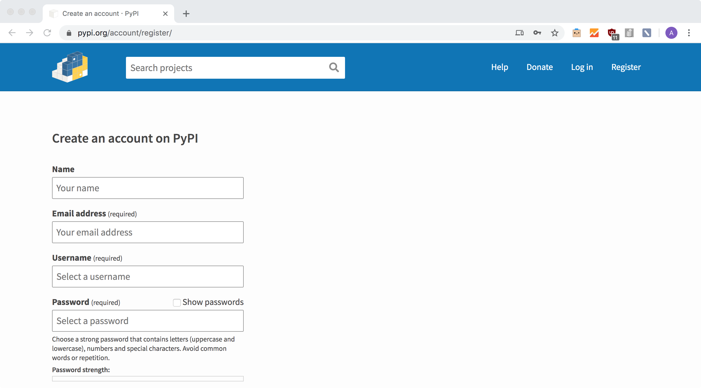

# Creating a Python Package and put it on PyPI

This cheat-sheet shows how to create a Python package and put it on [PyPI](https://pypi.org/) so everyone can install your awesome library or framework using `pip install <your-awesome-package-name>`. The main reference is to be found at this link : https://packaging.python.org/tutorials/packaging-projects/.

## Step 1 : Register

First thing to do is to register on the [PyPI](https://pypi.org/) platform using this link : https://pypi.org/account/register/. So now you can have your own account to manage your "online" Python packages.



## Step 2 : Have the right dependencies

We will need three dependencies to be installed

```bash
pip install wheel
pip install setuptools
pip install twine
```

## Step 3 : Create the setup file

The file is self-explanatory, we define all information related to our package or library, like its main name, version we're uploading, the linked github repo etc...

```python
import setuptools

with open("README.md", "r") as fh:
    long_description = fh.read()

setuptools.setup(
    name="ostorlab",
    version="0.0.0",
    author="Amine LEMAIZI",
    author_email="contact@lemaizi.com",
    description="A personal machine learning library made for experimental purposes",
    long_description=long_description,
    long_description_content_type="text/markdown",
    url="https://github.com/aminelemaizi/ostorlab",
    packages=setuptools.find_packages(),
    classifiers=[
        "Programming Language :: Python :: 3",
        "License :: OSI Approved :: MIT License",
        "Operating System :: OS Independent",
        "Development Status :: 1 - Planning",
    ],
    python_requires='>=3.6',
```


## Step 4 : Generating source distribution and uploading to PyPI

Generating source distribution 

```python
python setup.py sdist bdist_wheel
```

Uploading source distribution to PyPI

```python
python -m twine upload --repository-url https://upload.pypi.org/legacy/ dist/*
```

Now all is clear, all what you need to install your package is internet and run the following command 

```python
pip install <your-awesome-package-name>
```

